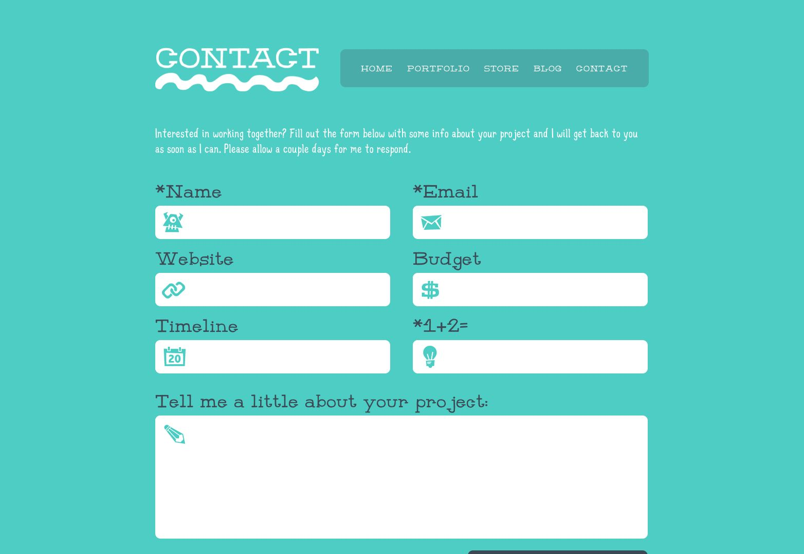

# 🍽️ FoodieFiesta – WordPress Food Blog Website

A beautiful and responsive food blogging website built using WordPress, Astra Theme, and Elementor. This project demonstrates the use of custom pages, categories, featured images, and SEO optimization using plugins.

---

## 🚀 Features

- Custom Home Page with Blog Grid Layout
- Single Post Templates with Author Info
- Categories like: *Spicy*, *Sweet*, *Healthy*
- Responsive Design (mobile-friendly)
- Elementor for page building
- Contact Form (Contact Form 7 plugin)
- SEO Integration (using RankMath or Yoast)
- Theme: Astra (Free version)

---

## 🧰 Tech Stack

- WordPress CMS
- Astra Theme
- Elementor (Free)
- Contact Form 7 Plugin
- RankMath SEO Plugin
- PHP, MySQL (via XAMPP/LocalWP)

---

## 🖼️ Screenshots

| Home Page | Blog Post | Contact Page |
|-----------|-----------|--------------|
|  |  |  |

---

## 🛠️ How to Install Locally

1. Clone the repo or download as ZIP
2. Launch **LocalWP** or **XAMPP**
3. Import `food-blog.sql` into phpMyAdmin
4. Copy `wp-content` to your WordPress install folder
5. Activate the Astra theme & install required plugins
6. Navigate to Home and start exploring

---

## 👤 Author

- Prithi Babu  
- 🌐 [GitHub Profile](https://github.com/prithi2004)  
- 📫 [LinkedIn](https://www.linkedin.com/in/prithi2004)

---

## 📌 License

This project is licensed under the MIT License.
