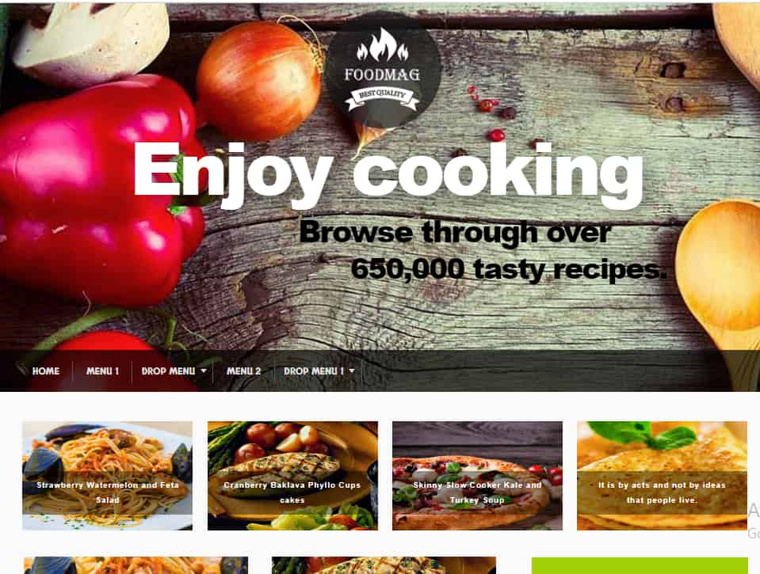

# 🍽️ Food Blog – WordPress Project

This is a simple and responsive Food Blog website built using **WordPress** with **free themes** and **popular plugins**. It showcases blog posts, images, and information about delicious recipes and travel experiences.

## 🔥 Features

- Home, About, Blog, and Contact pages
- Mobile-friendly and responsive layout
- Integrated blog post feature using WordPress editor
- Contact form using **Contact Form 7**
- Custom sections using **Elementor**
- SEO-friendly and easy to customize

## 🛠️ Tech Stack

- ✅ WordPress (CMS)
- ✅ HTML, CSS (via theme customization)
- ✅ Free Theme: Astra
- ✅ Plugins: Elementor, Contact Form 7


## 📷 Screenshots

| Homepage | Blog Page | Contact Page |
|----------|-----------|--------------|
|  |  |  |

---

## 📁 Folder Structure


## 💻 Tech Stack

- WordPress CMS
- PHP, HTML, CSS
- MySQL (Local DB for development)
- WP Theme: Astra (Free)
- Plugins: Elementor, WPForms, Yoast SEO

---


## 🛠️ Installation Instructions

1. Download ZIP or Clone Repo:
   ```bash
   git clone https://github.com/prithi2004/Wordpress-Projects.git

2.Import the project into LocalWP or XAMPP

3.Import the food-blog.sql database (if available)

4.Activate the Astra theme and necessary plugins

5.Customize using Elementor / WP Editor

🌟 Highlights
Simple and Clean Layout

Perfect for beginners to understand WP structure

Extensible with custom post types and categories

🤝 Contributing
Pull Requests are welcome! If you find bugs or want to improve design or performance, feel free to fork and PR.

📬 Contact
Made with ❤️ by Prithi Babu
🔗 LinkedIn

yaml
Copy
Edit

---

### 📥 Next Step

1. **Create a folder** inside your `Food blog wordpress-project` directory: `screenshots`
2. Add 2–3 screenshots (Homepage, Blog, Contact Page)
3. Upload the `README.md` file into the **food blog** folder
4. Create a **branch** (e.g., `add-readme`) and open a **Pull Request**

---

Say **“Done”** once you’ve added it and I’ll:

- Help you deploy the live site on free hosting
- Guide you through a WordPress plugin project
- Suggest a repo for your first external Pull Request
